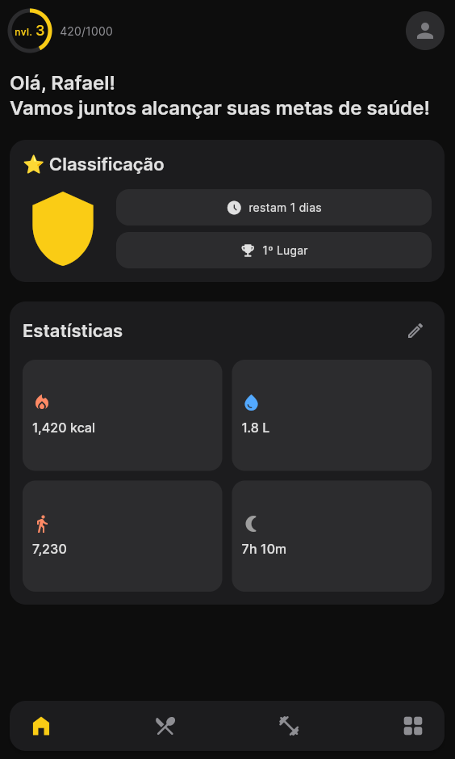
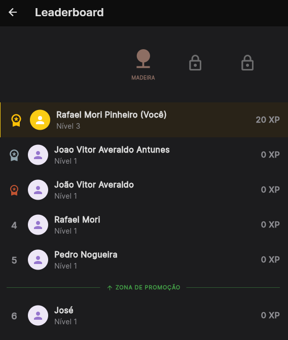
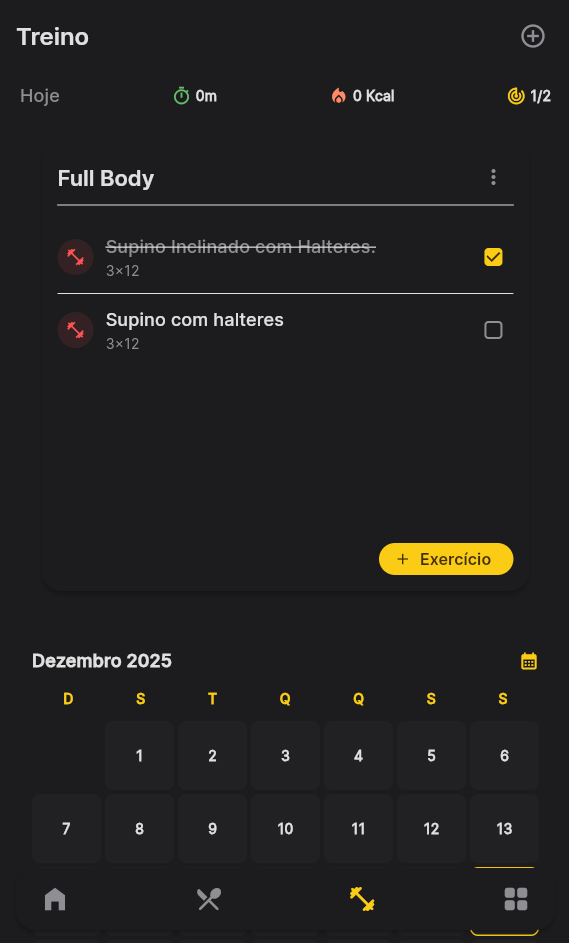

# Strive

## Conceito do projeto

O **Strive** é uma aplicação móvel multiplataforma desenvolvida para centralizar a gestão da saúde de atletas e entusiastas do bem-estar. A principal finalidade do projeto é resolver a fragmentação de dados de saúde, integrando em um único ambiente o controle de treinos de musculação, dietas nutricionais, monitoramento de hidratação e, mais recentemente, a gestão medicamentosa.

O diferencial do projeto reside em seu sistema robusto de **Gamificação**. Inspirado em aplicativos de aprendizado de idiomas, o Strive implementa um sistema de ligas semanais (com promoção e rebaixamento), ganho de XP (pontos de experiência) por tarefas concluídas e um *Leaderboard* dinâmico. Isso visa aumentar o engajamento do usuário e transformar a manutenção da saúde em um hábito consistente e divertido.

## Pré-requisitos e recursos utilizados

O grupo utilizou a linguagem **Dart** e o framework **Flutter** para o desenvolvimento front-end e mobile, aplicando conceitos avançados de Engenharia de Software.

**Tecnologias e Bibliotecas Principais:**
* **Flutter & Dart:** Base do desenvolvimento.
* **Firebase (Google):**
    * *Firestore Database:* Para persistência de dados em nuvem (NoSQL).
    * *Firebase Authentication:* Para gestão de identidade e login.
* **Riverpod:** Para gerenciamento de estado reativo e injeção de dependência (utilizando `AsyncNotifier` e `FutureProvider`).
* **GoRouter:** Para navegação declarativa e deep linking.
* **Slang:** Para internacionalização (i18n) e suporte a múltiplos idiomas.
* **Clean Architecture:** Padrão arquitetural utilizado para separar as camadas de *Domain*, *Data* e *Presentation*.

**APIs e Recursos Externos:**
* **OpenFoodFacts API:** Utilizada para busca de informações nutricionais de alimentos.
* **Wger Workout API:** Utilizada como base de dados para exercícios e grupos musculares.

## Passo a passo

O desenvolvimento do projeto seguiu uma metodologia iterativa, focada na implementação de funcionalidades por módulos (Feature-first):

1.  **Estruturação e Arquitetura:** Inicialmente, definimos a estrutura de pastas seguindo a Clean Architecture e configuramos o ambiente com Flutter e Firebase.
2.  **Módulo de Autenticação e Perfil:** Implementamos o login e a criação de perfil do usuário, salvando dados vitais como peso, altura e nível de atividade no Firestore.
3.  **Core Features (Treino e Dieta):**
    * Desenvolvemos o CRUD de treinos, permitindo criar planos personalizados.
    * Integramos a API de alimentos para o cálculo automático de macros na dieta.
4.  **Refatoração para Riverpod:** Migramos o gerenciamento de estado para Riverpod para lidar melhor com a assincronicidade e evitar *rebuilds* desnecessários.
5.  **Sistema de Gamificação (Engine):**
    * Criamos a lógica de cálculo de XP (Total vs. Semanal).
    * Implementamos o algoritmo de "Virada de Semana", que processa promoções e rebaixamentos de liga com base no desempenho do usuário.
    * Desenvolvemos a UI do Leaderboard com animações e filtros por liga.


## Instalação

Para recriar o ambiente de desenvolvimento do Strive, siga os passos abaixo:

1.  **Clone o repositório:**
    Execute o comando no terminal:
    ```bash
    git clone https://github.com/Rafael-Mori-2022/strive-app.git
    cd strive-app
    ```

2.  **Instale as dependências:**
    Na pasta raiz do projeto, execute:
    ```bash
    flutter pub get
    ```

3.  **Configuração do Firebase (Importante):**
    * Como os arquivos de configuração (`google-services.json` e `GoogleService-Info.plist`) são sensíveis e geralmente ignorados no git, você precisará criar um projeto no Console do Firebase.
    * Adicione os arquivos gerados pelo Firebase nas pastas `android/app` e `ios/Runner`, respectivamente.

4.  **Geração de Código:**
    O projeto utiliza geradores de código para tradução e serialização. Execute:
    ```bash
    dart run build_runner build --delete-conflicting-outputs
    dart run slang
    ```

## Execução

Para rodar o projeto em um emulador ou dispositivo físico:

1.  Abra o emulador (Android Studio ou Simulator do iOS) ou conecte seu dispositivo via USB.
2.  No terminal, dentro da pasta do projeto, execute:
    ```bash
    flutter run
    ```
    *Dica: Caso encontre erros de cache, utilize `flutter clean` antes de rodar novamente.*

## Bugs/problemas conhecidos

Durante o desenvolvimento, identificamos os seguintes comportamentos que podem requerer atenção:

* **Escalabilidade do Leaderboard:** Atualmente, o Leaderboard busca todos os usuários para realizar a ordenação em memória. Em um cenário com milhares de usuários, isso pode gerar lentidão ou alto consumo de leitura no Firestore. A solução futura seria implementar *Cloud Functions* para processar o ranking no servidor.
* **Delay na atualização de XP:** Em conexões lentas, o *SnackBar* de "Ganho de XP" pode aparecer antes da confirmação do banco de dados, devido à natureza otimista da UI.


## Autores

* **Rafael Mori Pinheiro** (Rafael-Mori-2022) - *Desenvolvimento Full-Stack & Gamification Logic*
* **Joao Vitor Averaldo Antunes** (Mun1nm) - *Desenvolvimento Mobile & Integrações*
* **Pedro Enrico Barchi Nogueira** (Pedro-bnogueira) - *Desenvolvimento Mobile & UI/UX*

## Imagens/screenshots

Abaixo estão as capturas de tela das principais funcionalidades do Strive:

### 1. Dashboard e Gamificação

<table>
  <tr>
    <td align="center" width="33%">
      
      <br />
      <b>1. Dashboard</b><br />
      <sub>Progresso diário, nível e atalhos.</sub>
    </td>
    <td align="center" width="33%">
      
      <br />
      <b>2. Leaderboard</b><br />
      <sub>Ranking semanal e sistema de ligas.</sub>
    </td>
    <td align="center" width="33%">
      
      <br />
      <b>3. Treinos</b><br />
      <sub>Gestão e execução de séries.</sub>
    </td>
  </tr>
</table>